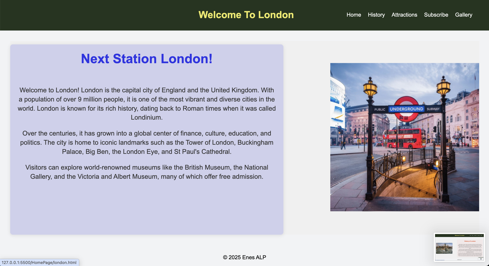
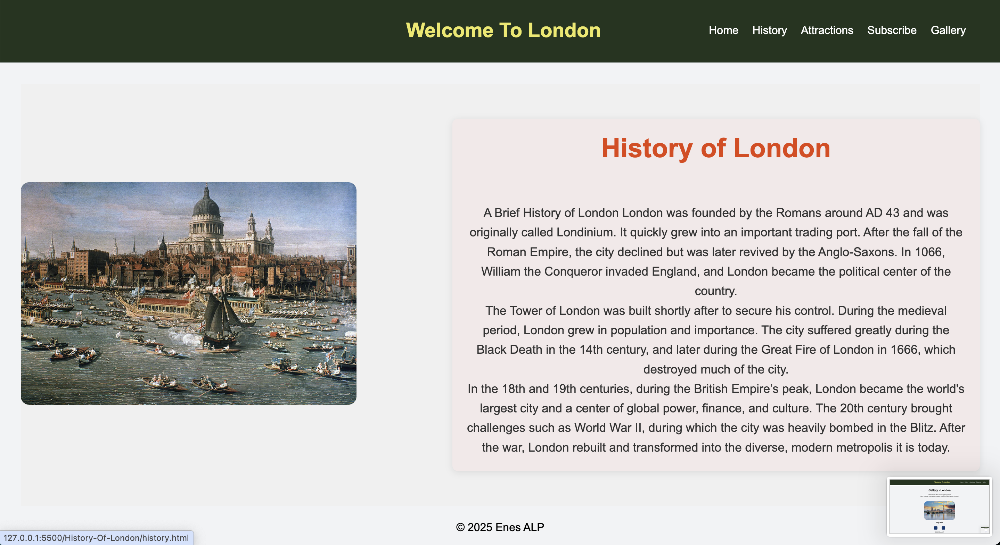
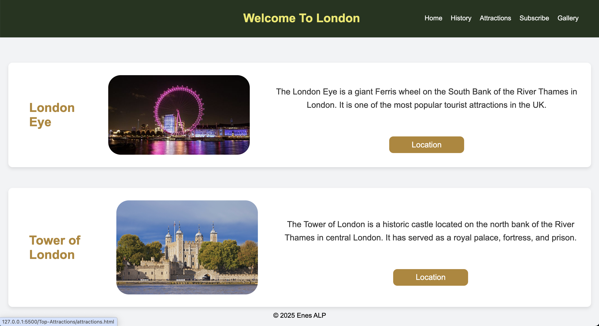
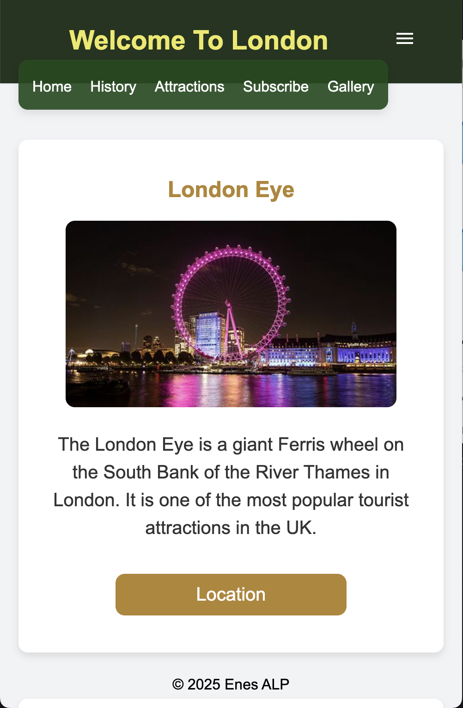
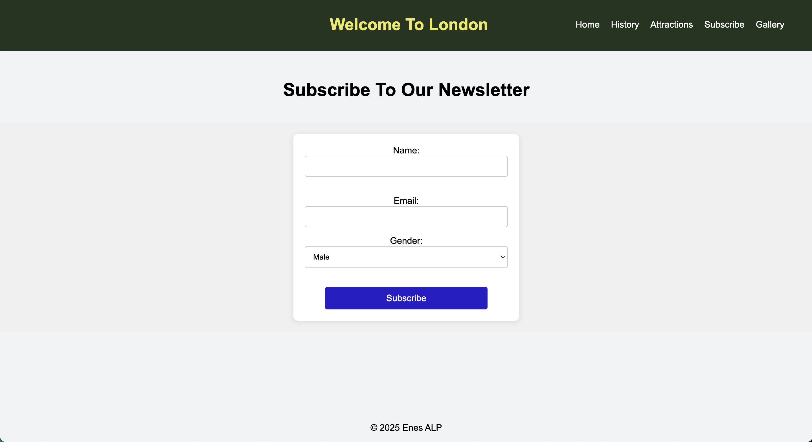
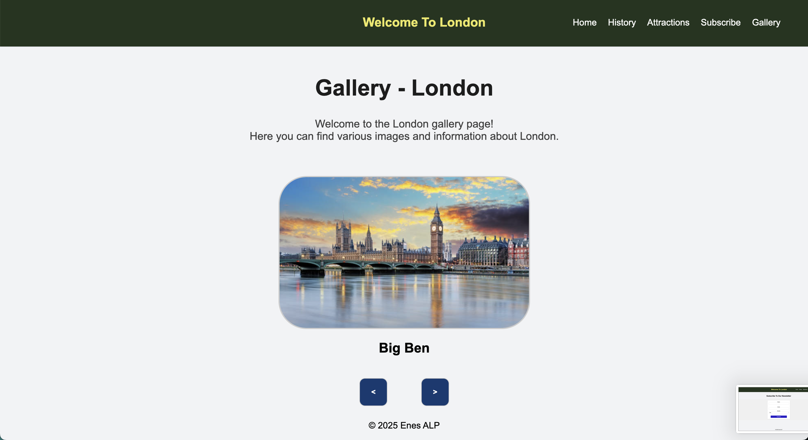

# Web App Design Final Ödevi
*Bu projeyi geliştirirken kullandığım teknolojiler ve nedenleri aşağıda listelenmiştir.*
## HTML:
  Projeyi geliştirirken 1 tanesi her sayfada kullandığım header
kısmını oluşturmak üzere toplam 6 farklı HTML sayfası oluşturdum. Bu
sayfalarda başlıklar, div, image ve p etiketlerini sıklıkla kullandım ve bültene
abone olunması için oluşturduğum sayfada form elementine yer verdim.
## CSS:
  Sayfa ve metin renklerinin düzenlenmesi için color, background-color
elementleri; mobil uyumluluk ve responsive tasarım için @media
elementini; flex, margin ve padding özelliklerini kullanarak hizalamaları
yapabilmek ve daha birçok farklı tasarımsal güzelleştirmeler için CSS
kullandım. Sayfalarda geçiş animasyonları ile kullanıcının gözüne güzel
gözükmesi amacıyla
‘animate.style’ adında bir CSS kütüphanesinden de yararlandım.
## Javascript:
  Her sayfada aynı header kodlarını tekrarlamamak için tek bir
sayfada header oluşturdum ve diğer sayfalardan ‘fetch’ yardımı ile bu
header getirildi. Gallery sayfasındaki resim geçişleri için fonksiyonları, DOM
Manipülasyonlarını ve ileri-geri butonları ile etkileşim sağlayabilmek için
‘event listener’ ları kullandım. Ayrıca header.js dosyasında responsive
tasarım sağlanabilmesi için sayfa genişliği header elementlerini sığdırmaya
yeterli olmadığı durumda header butonlarının yerini toggle menü alıyor ve
bu menü aracılığıyla diğer sayfalara daha rahat erişim sağlanabiliyor.

